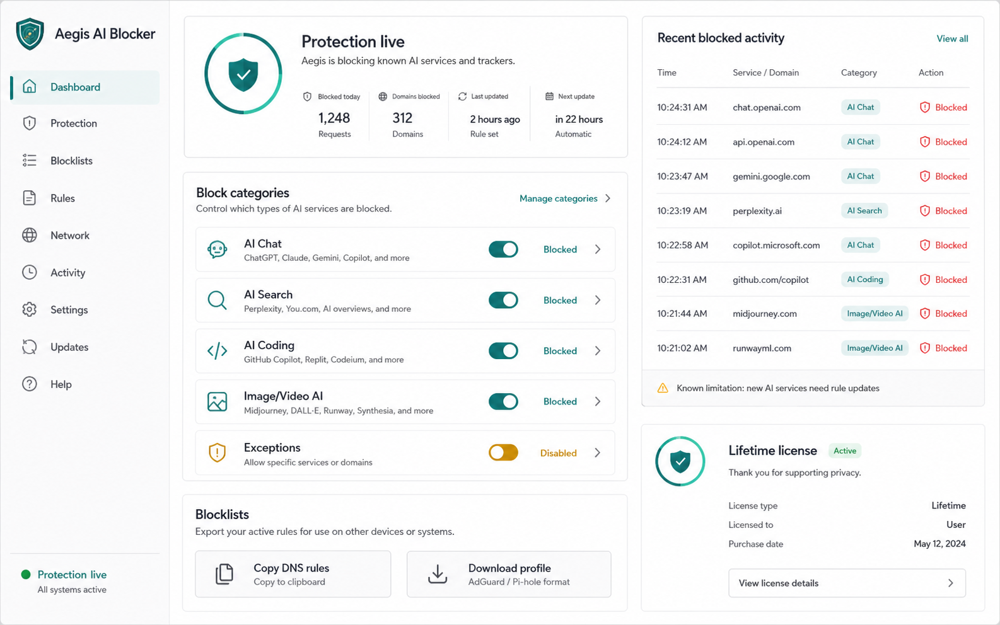

# Aegis AI Blocker

[](https://github.com/Sebby1770/aegis-ai-blocker/actions/workflows/ci.yml)

Aegis is a policy engine for intentional digital boundaries: choose a value — Focus, Child-safe,
School exam, Workplace compliance — and Aegis turns it into ready-to-use AI blocklists for phones,
desktop browsers, and home routers. It is sold as a one-time lifetime purchase.

Every block explains itself (which service, which category, exact vs. parent-domain match), every
service carries a breakage-risk label and a last-verified date, and the whole catalog is public —
trust is a visible feature, not a promise. Today Aegis enforces **block**; softer friction (warn,
delay, schedule) and rituals are on the roadmap behind an always-on agent.

It ships as:

- a React/Vite marketing site + web dashboard (home, philosophy, catalog, features, pricing, FAQ,
  legal pages, and a four-page policy dashboard)
- an installable PWA: offline-capable dashboard via a web app manifest and service worker
- Vercel serverless API routes for Stripe Checkout, signed webhooks, entitlements, authenticated
  rule exports, and health checks
- a Supabase Postgres schema with row-level security, audit logs, and durable rate limiting
- generated DNS/blocklist exports (AdGuard/uBlock, hosts, dnsmasq, plain, Safari content blocker)
- a SwiftUI iOS companion app whose rule data is generated from the same pack as the web app

Honesty is part of the product: no static app can block "all AI" forever. Aegis blocks the curated
services in its rule pack and updates that pack as new AI services appear.



## Architecture

```text
Browser (React SPA)                 Vercel serverless API            Third parties
┌───────────────────────┐          ┌──────────────────────────┐     ┌──────────────┐
│ /        home         │  bearer  │ POST /api/create-        │────▶│ Stripe       │
│ /features /pricing    │  token   │       checkout-session   │     │ Checkout     │
│ /faq     marketing    │─────────▶│ GET  /api/entitlement    │     └──────┬───────┘
│ /app     dashboard    │          │ GET  /api/export         │            │ signed
│ /privacy /terms       │          │ GET  /api/health         │            │
│ /refunds legal        │          │ POST /api/stripe-webhook │◀───────────┘ webhook
└──────────┬────────────┘          └────────────┬─────────────┘
           │ magic link                         │ service role (server-only)
           ▼                                    │
┌───────────────────────┐                       ▼
│ Supabase Auth         │          ┌──────────────────────────┐
└───────────────────────┘          │ Postgres + RLS           │
                                   │ profiles, licenses,      │
                                   │ payment_events,          │
                                   │ audit_logs, rate_limits  │
                                   └──────────────────────────┘
```

Trust boundaries:

- The browser can sign in, start Checkout, and read its own entitlement. Nothing else.
- Licenses are written only by the webhook handler after Stripe signature verification.
- Refunds and disputes revoke licenses automatically through the same signed webhook.
- The Supabase service-role key, Stripe secret key, and webhook secret are server-only and never
  carry a `VITE_` prefix.

Full details: [docs/architecture.md](docs/architecture.md).

## Development

```bash
npm install
npm run dev
```

Full verification (rules, lint, typecheck, tests, build):

```bash
npm run verify
```

Other scripts:

| Script | Purpose |
| --- | --- |
| `npm test` | Run the Vitest suite |
| `npm run generate:rules` | Regenerate `rules/generated/` from the rule pack |
| `npm run typecheck:api` | Typecheck the serverless API |
| `npm run audit:deps` | Fail on high-severity dependency vulnerabilities |

CI runs all of the above plus a gitleaks secret scan on every push and pull request, and Dependabot
keeps dependencies current.

## Production setup

Follow [docs/launch-checklist.md](docs/launch-checklist.md). Summary:

1. Create a Supabase project and apply `supabase/schema.sql` (or `supabase db push` with the
   migrations in `supabase/migrations/`).
2. Create a one-time Stripe Price for lifetime access.
3. Set the variables from `.env.example` in Vercel — server secrets must not use `VITE_`.
4. Point a Stripe webhook at `/api/stripe-webhook` listening for:
   - `checkout.session.completed`
   - `checkout.session.async_payment_succeeded`
   - `charge.refunded`
   - `charge.dispute.created`
5. Test the full purchase → entitlement → refund → revocation loop with Stripe test cards before
   going live.

The app never trusts frontend payment state. The browser starts Checkout, Stripe redirects the
customer, and only the signed webhook writes or revokes `lifetime_licenses` rows using the
server-only Supabase secret key.

## Security

Controls implemented in this repository:

- Stripe webhook signature verification with idempotent event processing
- Server-side entitlement checks; exports gate on the server, not the client
- Supabase RLS on every table; `payment_events`, `audit_logs`, and `rate_limits` are service-role-only
- Durable cross-instance rate limiting (Postgres-backed, hashed keys, in-memory fallback)
- Zod input validation, bounded request bodies, and generic error responses with request IDs
- Structured JSON logs with secret/PII redaction — tokens and emails never reach logs
- CSP, HSTS, nosniff, frame denial, referrer and permissions policies on every response
- No source maps in production, no secrets in git history, gitleaks in CI

Vulnerability reporting and the full 50-risk checklist mapping:
[SECURITY.md](SECURITY.md) · [docs/security-checklist.md](docs/security-checklist.md)

## Monitoring & operations

- `GET /api/health` — liveness endpoint for UptimeRobot/Pingdom/Vercel checks
- Vercel function logs are structured JSON with request IDs (`x-request-id` is returned to clients)
- `audit_logs` records every license activation, refund, and dispute revocation
- Recommended: Vercel log drains + alerts, Supabase advisors, and Stripe Radar (see
  [docs/architecture.md](docs/architecture.md#monitoring--alerts))

## iOS app

The iOS project is generated with XcodeGen:

```bash
xcodegen generate --spec ios/project.yml
open ios/AegisAIBlocker.xcodeproj
```

For true device-wide iOS blocking, a production build needs Apple Network Extension entitlements or
a managed DNS provider; without them the app manages and shares rule exports.

## Repository layout

```text
src/                   Web app: pages, router, SaaS context, rule pack data
api/                   Vercel serverless functions + shared _lib (guards, logging, Stripe, Supabase)
supabase/              schema.sql, migrations, config
rules/generated/       Generated blocklists (kept in sync by CI)
scripts/               Blocklist generator
ios/                   SwiftUI iOS project + XcodeGen spec
docs/                  Architecture, launch checklist, security checklist
.github/               CI workflow, Dependabot config
```

## License

Source-available, all rights reserved — see [LICENSE](LICENSE). The rule pack is part of the
commercial product and may not be redistributed.
